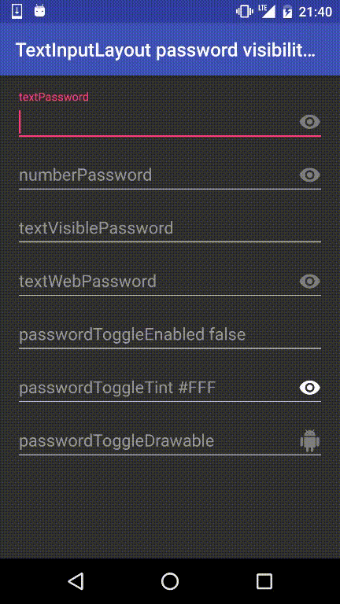

# TextInputLayout Password Visibility Toggle Sample

Android support library 24.2.0 is released and  “Password Visibility Toggle “ is introduced.

> TextInputLayout adds support for the [password visibility toggle](https://material.google.com/components/text-fields.html#text-fields-required-fields) from the material design specification.


## Example

```xml
<android.support.design.widget.TextInputLayout
    android:layout_width="match_parent"
    android:layout_height="wrap_content">

    <EditText
        android:layout_width="match_parent"
        android:layout_height="wrap_content"
        android:hint="textPassword"
        android:inputType="textPassword" />
</android.support.design.widget.TextInputLayout>
```





